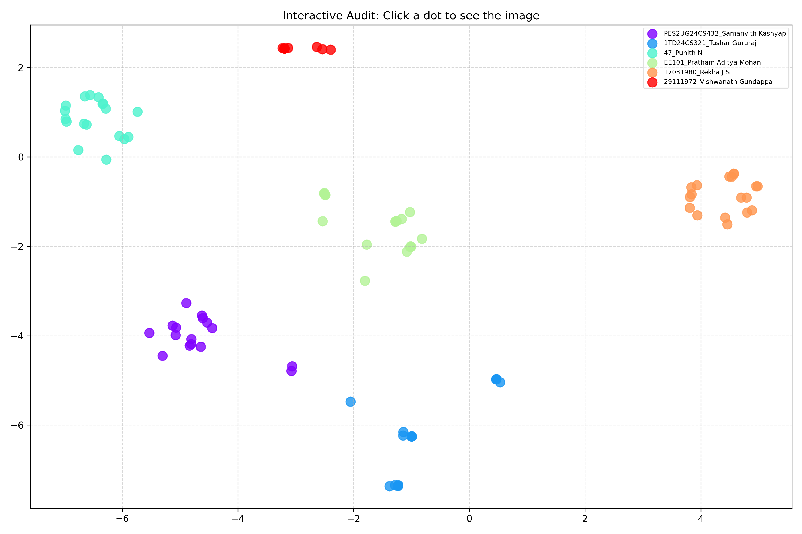

# Locus: Fault-Tolerant Biometric Pipeline

## Project Overview
Locus is a secure attendance and identity verification system engineered to mitigate "presentation attacks" (face spoofing). Unlike standard face recognition tools that can be compromised by static media, Locus validates physical presence using Liveness Detection and ensures data integrity through automated statistical auditing. The pipeline is optimized to achieve real-time inference on standard CPU hardware.

## Key Technical Capabilities

### 1. Liveness Detection (Anti-Spoofing)
The system prevents security breaches by distinguishing between live human subjects and static photos. It uses temporal analysis of the Eye Aspect Ratio (EAR) to enforce a mandatory "Blink Event" validation before verifying identity.

### 2. Reliable Identification
Instead of simple matching thresholds, the system uses a k-Nearest Neighbors (k-NN) consensus algorithm. It requires a majority vote from multiple vector neighbors to confirm an identity, significantly reducing false positives in dynamic lighting conditions.

### 3. Data Auditing & Explainability
Includes a dedicated visualization tool (`insight.py`) that maps high-dimensional face data into 2D clusters using t-SNE. This allows for the mathematical detection and removal of "outlier" images (noisy data) before model training.

### 4. CPU Optimization
Engineered for efficiency on non-GPU systems. It utilizes HOG (Histogram of Oriented Gradients) descriptors and adaptive frame skipping to maintain a smooth 30 FPS video feed.

## System Visualization
The audit tool generates a cluster map to verify that the model allows clear separation between different identities.

## File Structure

* **main.py**: The master CLI controller. Run this to access all system functions.
* **src/**: Source code directory.
    * **core_logic.py**: Mathematical formulas for liveness/landmarks.
    * **enroll.py**: Database serialization engine.
    * **verify.py**: Real-time deployment engine.
    * **insight.py**: Data auditing visualization tool.
* **data.csv**: Database linking facial identities to IDs.

## Installation

1.  Clone the repository.
2.  Install dependencies:
    
    pip install -r requirements.txt

    *(If dlib fails to install on Windows, install the provided .whl file manually: `pip install dlib-19.24.99-cp312-cp312-win_amd64.whl`)*

## Usage Guide

**Step 1: Data Setup**
Place images in `dataset/` and update `data.csv`.

**Step 2: Run the Suite**
Launch the master controller:
python main.py

**Step 3: Operation**
Select your desired module from the interactive menu:
* **[1] Enrollment:** To build the database.
* **[2] Insight:** To check data quality.
* **[3] Verify:** To start the security camera.

## Methodology
* **Feature Extraction:** 128-D embeddings via ResNet-34.
* **Face Detection:** HOG (Histogram of Oriented Gradients).
* **Liveness Verification:** Euclidean distance of 6-point facial landmarks.

